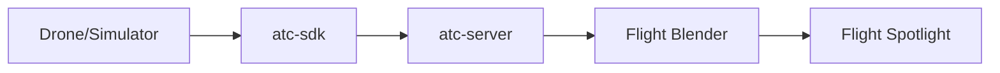

# ATC Drone System

Real-time drone traffic management system using OpenUTM (Flight Blender + Flight Spotlight).

## Overview

The ATC-Drone system acts as the "brain" between drones and the OpenUTM stack:



**Key Features:**
- **Real-time telemetry** - Receives drone positions via SDK, syncs to Flight Blender
- **Conflict detection** - Predicts collisions 10-30s ahead
- **WebSocket streaming** - Live updates to UI clients
- **Flight visualization** - Drones appear on Spotlight's 3D globe

## Project Structure

```
atc-drone/
├── crates/
│   ├── atc-core/       # Pure logic (no networking)
│   │   ├── conflict.rs   # Conflict detection engine
│   │   ├── models.rs     # DroneState, Telemetry, Mission
│   │   ├── routing.rs    # Route suggestions
│   │   └── rules.rs      # Safety thresholds
│   │
│   ├── atc-server/     # Always-on backend (Axum)
│   │   ├── api/          # REST + WebSocket endpoints
│   │   ├── state/        # In-memory store (DashMap)
│   │   └── loops/        # Conflict detection, Blender sync
│   │
│   ├── atc-sdk/        # Drone integration SDK
│   │   ├── client.rs     # Register + connect
│   │   └── telemetry.rs  # Stream position updates
│   │
│   ├── atc-blender/    # Flight Blender API client
│   │   └── client.rs     # HTTP client with JWT auth
│   │
│   └── atc-cli/        # CLI tools & simulators
│       └── bin/
│           └── send_one_track.rs  # Single drone simulator
├── Cargo.toml          # Workspace manifest
└── ROADMAP.md          # Project milestones
```

## Quick Start

```bash
# 1. Start Flight Blender (port 8000) and Spotlight (port 5050)

# 2. Build and run the ATC Server
cd /home/uci/Project/atc-drone
cargo run -p atc-server

# 3. In another terminal, run the drone simulator
cargo run -p atc-cli --bin send_one_track -- --duration 120 --rate 2

# 4. Open Flight Spotlight
#    http://localhost:5050/spotlight
#    Click "Stream flights" centered on Irvine (33.68, -117.82)
```

## API Endpoints (atc-server on port 3000)

| Method | Endpoint | Description |
|--------|----------|-------------|
| POST | `/v1/drones/register` | Register a drone |
| POST | `/v1/telemetry` | Send position update |
| GET | `/v1/drones` | List all drones |
| GET | `/v1/conflicts` | Get active conflicts |
| WS | `/v1/stream` | Real-time WebSocket updates |

## SDK Usage (Rust)

```rust
use atc_sdk::{AtcClient, Telemetry};

#[tokio::main]
async fn main() {
    let client = AtcClient::new("http://localhost:3000");
    
    // Register drone
    client.register("DRONE001", "quadcopter").await.unwrap();
    
    // Send telemetry
    let telemetry = Telemetry {
        drone_id: "DRONE001".into(),
        lat: 33.6846,
        lon: -117.8265,
        altitude_m: 50.0,
        heading: 90.0,
        speed_mps: 5.0,
        timestamp: chrono::Utc::now(),
    };
    client.send_telemetry(telemetry).await.unwrap();
}
```

## Related Repositories

- **flight-blender-irvine** - UTM Backend (Flight Blender fork)
- **flight-spotlight-irvine** - 3D Visualization UI (Flight Spotlight fork)

## Requirements

- Rust 1.70+
- Flight Blender running on localhost:8000
- Flight Spotlight running on localhost:5050
- Redis (for Spotlight background jobs)
