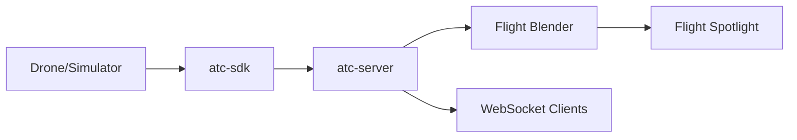

# ATC Drone System

Real-time drone traffic management system using OpenUTM (Flight Blender + Flight Spotlight).

## Overview

The ATC-Drone system acts as the "brain" between drones and the OpenUTM stack:



**Key Features:**
- **Real-time telemetry** - Receives drone positions via SDK, syncs to Flight Blender
- **Conflict detection** - Predicts collisions 10-30s ahead using CPA algorithm
- **Command dispatch** - HOLD, ALTITUDE_CHANGE, REROUTE commands
- **Flight plan approval** - Pre-flight deconfliction with route options
- **WebSocket streaming** - Live updates to UI clients
- **Flight visualization** - Drones appear on Spotlight's 3D globe

## Quick Start

```bash
# 1. Start Flight Blender + Spotlight (Docker)
cd /home/uci/Project/flight-blender-irvine && docker-compose up -d
cd /home/uci/Project/flight-spotlight-irvine && docker-compose up -d

# 2. Build and run the ATC Server
cd /home/uci/Project/atc-drone
cargo run --bin atc-server

# 3. Run the multi-drone simulator (crossing scenario)
cargo run --bin send_multi_track -- --scenario crossing --duration 120

# 4. Open Flight Spotlight
#    http://localhost:5050/spotlight
#    Click "Stream flights" centered on Irvine (33.68, -117.82)
```

## Project Structure

```
atc-drone/
├── crates/
│   ├── atc-core/       # Pure logic (no networking)
│   │   ├── conflict.rs   # Conflict detection engine (CPA)
│   │   ├── models.rs     # DroneState, Telemetry, Command, FlightPlan
│   │   ├── routing.rs    # Route suggestions
│   │   ├── spatial.rs    # Haversine distance, plan conflict check
│   │   └── rules.rs      # Safety thresholds (configurable)
│   │
│   ├── atc-server/     # Always-on backend (Axum)
│   │   ├── api/          # REST + WebSocket endpoints
│   │   │   ├── routes.rs   # Drone registration, telemetry
│   │   │   ├── commands.rs # Command dispatch API
│   │   │   └── flights.rs  # Flight plan submission
│   │   ├── state/        # In-memory store (DashMap)
│   │   └── loops/        # Conflict detection, Blender sync
│   │
│   ├── atc-sdk/        # Drone integration SDK
│   │   ├── client.rs     # Register, telemetry, commands
│   │   └── telemetry.rs  # Position updates with velocity calc
│   │
│   ├── atc-blender/    # Flight Blender API client
│   │   ├── client.rs     # HTTP client with JWT auth
│   │   └── sync_geofences.rs  # Conflict → Geofence push
│   │
│   └── atc-cli/        # CLI tools & simulators
│       └── bin/
│           ├── send_one_track.rs    # Single drone (circular)
│           ├── send_multi_track.rs  # Multi-drone scenarios
│           └── send_flight.rs       # Flight plan workflow
└── Cargo.toml          # Workspace manifest
```

## API Endpoints (atc-server on port 3000)

### Drones & Telemetry
| Method | Endpoint | Description |
|--------|----------|-------------|
| POST | `/v1/drones/register` | Register a drone |
| POST | `/v1/telemetry` | Send position update |
| GET | `/v1/drones` | List all drones |
| GET | `/v1/conflicts` | Get active conflicts |
| WS | `/v1/stream` | Real-time WebSocket updates |

### Commands
| Method | Endpoint | Description |
|--------|----------|-------------|
| POST | `/v1/commands` | Issue command (HOLD, ALTITUDE_CHANGE, REROUTE) |
| GET | `/v1/commands/next?drone_id=` | Poll for next command |
| POST | `/v1/commands/ack` | Acknowledge command execution |
| GET | `/v1/commands` | List all pending commands |

### Flight Plans
| Method | Endpoint | Description |
|--------|----------|-------------|
| POST | `/v1/flights/plan` | Submit flight plan for approval |
| GET | `/v1/flights` | List all flight plans |

## SDK Usage (Rust)

```rust
use atc_sdk::AtcClient;

#[tokio::main]
async fn main() -> anyhow::Result<()> {
    let mut client = AtcClient::new("http://localhost:3000");
    
    // Register drone (auto-generates ID if None)
    let resp = client.register(Some("DRONE001")).await?;
    println!("Registered: {}", resp.drone_id);
    
    // Send position update
    client.send_position(33.6846, -117.8265, 50.0, 90.0, 10.0).await?;
    
    // Poll for commands
    if let Some(cmd) = client.get_next_command().await? {
        println!("Received: {:?}", cmd.command_type);
        client.ack_command(&cmd.command_id).await?;
    }
    
    Ok(())
}
```

## Simulators

### Single Drone (Circular Path)
```bash
cargo run --bin send_one_track -- --icao DRONE001 --duration 60
```

### Multi-Drone Scenarios
```bash
# Crossing paths (conflict detection demo)
cargo run --bin send_multi_track -- --scenario crossing

# Parallel paths (no conflict)
cargo run --bin send_multi_track -- --scenario parallel

# 4 drones converging (high conflict)
cargo run --bin send_multi_track -- --scenario converging
```

### Flight Plan Workflow
```bash
cargo run --bin send_flight  # Request plan → Fly route → Complete
```

## Services

| Service | Port | Description |
|---------|------|-------------|
| ATC Server | 3000 | Main backend |
| Flight Blender | 8000 | UTM backend (Docker) |
| Flight Spotlight | 5050 | 3D visualization (Docker) |
| Redis | 6379 | Spotlight cache |
| Tile38 | 9851 | Geo queries |

## Requirements

- Rust 1.70+
- Docker & Docker Compose (for Blender/Spotlight)
- Flight Blender running on localhost:8000
- Flight Spotlight running on localhost:5050

## Related Repositories

- **flight-blender-irvine** - UTM Backend (Flight Blender fork)
- **flight-spotlight-irvine** - 3D Visualization UI (Flight Spotlight fork)
